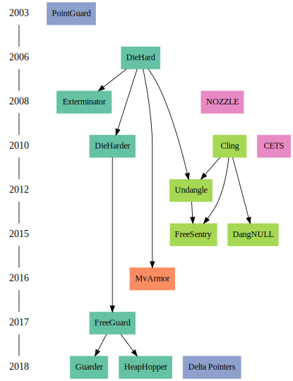

# Bibtex2TimelineHack

All code is written... poorly, the following program contains hacks and due to 
it's content should not be viewed by anyone. Also it makes a timeline from 
BibTex using custom attributes.

# Results

Because results are easy to process, this is what it makes:



# How do I make this diagram... Ehhh

So because I didn't want to just use references as a source for what paper was
based on what it doesn't use references for the arrows... Also custom bibtex is 
used...

## Step 1:

Get your references.bib, like the one I uploaded

## Step 2:

Add the abbreviation tag to the items you want to be seen in your final 
rendering, the rest is ignored (because I was too lazy to create 2 bibtex files, 
one for references I needed to use, and one for the actual papers I was 
investigating)

### Step 2b:

If you have some sort of classification, it can use colors for the different 
classes, in the example what sort of heap defense.

To do this add a 'class' attribute to the bibtex entry.

### Step 2c:

Check if it looks a bit like this:

```
@inproceedings{akritidis2010cling,
  title={Cling: A Memory Allocator to Mitigate Dangling Pointers.},
  author={Akritidis, Periklis},
  booktitle={USENIX Security Symposium},
  pages={177--192},
  year={2010},
  abbreviation={Cling},                         <- Added
  class={Temporal}                              <- Optional for colors
}
```

## Step 3:

Create an edges file, this file defines the edges in the diagram, made this way 
because I felt I needed to determine what relations papers have not through
crawling but actual analysis of the papers

Format of the file is 

```
paper_abbreviation => paper_abbreviation
```

With allowed comments using '#' and empty lines.

## Step 4:

Generating the actual dot files
```
python3 draw_timeline.py {references_file} {edges_file} | dot
```

Picture was generated using:
```
python3 draw_timeline.py references.bib paper_edges.txt | dot -Tsvg > timeline.svg
```